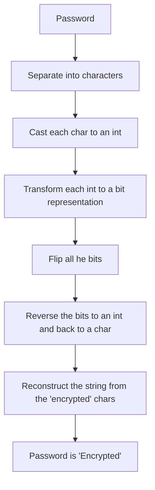

# NaiveTextEncryptor

>[!WARNING]
>This project is still in construction

I built this as a joke . The code is very low quality and should not be used . The core idea is simple.



Utiling a simple bitwise-NOT operation we can achieve "toy" encryption like in the examples provided below

## Examples

**Example 1**

```
Password : ILoveYou
```

We get ( as the full program output )

```
Password characters
I
L
o
v
e
Y
o
u
Characters to integers
73
76
111
118
101
89
111
117
Integers to bits
01001001
01001100
01101111
01110110
01100101
01011001
01101111
01110101
Reversed bits
10110110
10110011
10010000
10001001
10011010
10100110
10010000
10001010
Reversed bits back to ints
182
179
144
137
154
166
144
138
Reversed ints back to encrypted chars
╢
│
É
ë
Ü
ª
É
è
Encrypted Password : ╢│ÉëܪÉè
```

Which contains the characters of the original password , their values after they have been casted to an int and their bit represantion . Also we can see their flipped bit representation as well as the encypted password on the end 

This function ( even if it is obvious ) works as the encryptor and the decryptor

if we input again 

```

Password : ╢│ÉëܪÉè

```

We get back the original password we gave at the start 

```

Encrypted Password : ILoveYou

```
