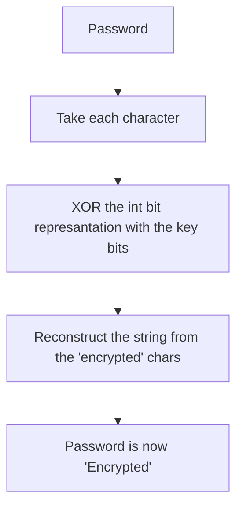

# NaiveTextEncryptor

>[!WARNING]
>This project is experiment , it's NOT something for real cryptographic use!

This is a simple XOR encryption algorithm written in C++23 



## Examples

**Example 1**

```
Give the password : ILoveC++23(^_^)
```

We get prompted for a key :

```
Give the encryption key : 420
```

Next we acquire our encrypted password and our new decryption key :

```
The password after encryption : φΦ╦╥┴τÅÅûùî·√·ì
Your new decryption key is (remember this) : 164
```

And finally we are asked if we want to re-run the encryptor :

```
Do you want to run the encryptor again ? (y/n) : N //We choose to terminate execution
```

This program ( even if it is obvious ) works as the encryptor and the decryptor

if we input again as the password the previous output with the exact same key , we get : 

```
Give the password : φΦ╦╥┴τÅÅûùî·√·ì
Give the encryption key : 164
The password after encryption : ILoveC++23(^_^)
```

We get back the original password we gave at the start , but why does that happen ? 

## The awesome XOR property 

For every XOR operation we can prove that B^A^A = B 

Assume B = 01010101 and A = 00000001 

01010101 ^ 00000001 = 10101010 and then 10101010 ^ 00000001 = 01010101 which is B again 

In my program i use the last 8 bits of every key ( that is why we need a decryption key ) as a very big encryption key , ex. 1291901 is not contained in 8 bits only.In comparison all printable characters are in the range 0-255 which can be easily contained in a single byte of 8 bits .


